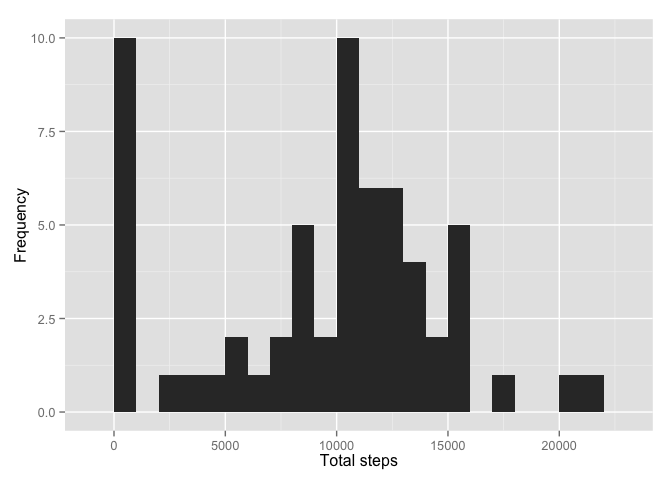
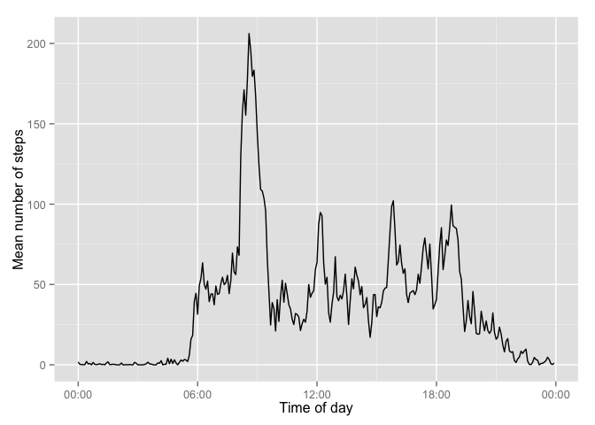
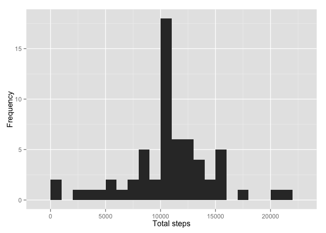
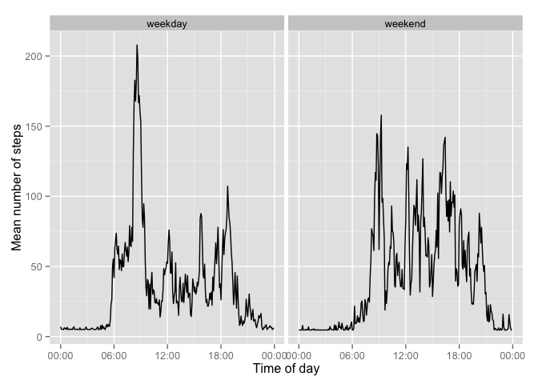

# Reproducible Research: Peer Assessment 1

## Loading and preprocessing the data
Check if data is uncompressed. Load data set.


```r
if(!file.exists('activity.csv')){
    unzip('activity.zip')
}
activity <- read.csv('activity.csv')
```

Processing. Create a column having both the date and interval columns.


```r
time <- formatC(activity$interval / 100, 2, format='f') 
activity$date.time <- as.POSIXct(paste(activity$date, time), format='%Y-%m-%d %H.%M', tz='GMT')
```

For analyzing the means at the different times of day, it will also be convenient to have a time column. To do this, I convert all of the dates to be for today. since we only care about the time for that column, it will help us with the analysis.


```r
activity$time <- format(activity$date.time, format='%H:%M:%S')
activity$time <- as.POSIXct(activity$time, format='%H:%M:%S')
```
## What is mean total number of steps taken per day?

Distribution of total number of steps per day within a histogram. Mean and median for the total steps per day::


```r
total.steps <- tapply(activity$steps, activity$date, sum, na.rm=TRUE)
library(ggplot2)
qplot(total.steps, xlab='Total steps', ylab='Frequency', binwidth = 1000)
```

 

```r
mean(total.steps)
```

```
## [1] 9354.23
```

```r
median(total.steps)
```

```
## [1] 10395
```

## What is the average daily activity pattern?

Mean steps for each five minute interval, and then put it in a data frame.


```r
mean.steps <- tapply(activity$steps, activity$time, mean, na.rm=TRUE)
daily.act.pattern <- data.frame(time = as.POSIXct(names(mean.steps)), mean.steps=mean.steps)
```

Let's take a look at a time series plot for the mean steps.


```r
library(scales)
ggplot(daily.act.pattern, aes(time, mean.steps)) + 
    geom_line() +
    xlab('Time of day') +
    ylab('Mean number of steps') +
    scale_x_datetime(labels = date_format(format='%H:%M'))
```

 

Which five minute interval has the highest mean number of steps?


```r
highest <- which.max(daily.act.pattern$mean.steps)
format(daily.act.pattern[highest,'time'], format='%H:%M')
```

```
## [1] "08:35"
```

## Imputing missing values

Calculate and report the total number of missing values in the dataset (i.e. the total number of rows with NAs). Directly shows in the summary.


```r
summary(activity$steps)
```

```
##    Min. 1st Qu.  Median    Mean 3rd Qu.    Max.    NA's 
##    0.00    0.00    0.00   37.38   12.00  806.00    2304
```

Devise a strategy for filling in all of the missing values in the dataset. The strategy does not need to be sophisticated. For example, you could use the mean/median for that day, or the mean for that 5-minute interval, etc.
Create a new dataset that is equal to the original dataset but with the missing data filled in.


Histogram of the imputed dataset.


```r
qplot(total.steps.imputed, xlab='Total steps', ylab='Frequency', binwidth = 1000)
```

 

Mean and median.


```r
mean(total.steps)
```

```
## [1] 9354.23
```

```r
mean(total.steps.imputed)
```

```
## [1] 10766.19
```

```r
median(total.steps)
```

```
## [1] 10395
```

```r
median(total.steps.imputed)
```

```
## [1] 10766.19
```

Imputing the missing data has increased the average number of steps.

## Are there differences in activity patterns between weekdays and weekends?

Create a new factor variable in the dataset with two levels – “weekday” and “weekend” indicating whether a given date is a weekday or weekend day.


```r
day.type <- function(date) {
    if (weekdays(date) %in% c('Saturday', 'Sunday')) {
        return('weekend')
    } else {
        return('weekday')
    }
}

day.types <- sapply(activity.imputed$date.time, day.type)
activity.imputed$day.type <- as.factor(day.types)
```

Create a dataframe that holds the mean steps for weekdays and weekends.


```r
mean.steps <- tapply(activity.imputed$steps, 
                     interaction(activity.imputed$time,
                                 activity.imputed$day.type),
                     mean, na.rm=TRUE)
day.type.pattern <- data.frame(time=as.POSIXct(names(mean.steps)),
                               mean.steps=mean.steps,
                               day.type=as.factor(c(rep('weekday', 288),
                                                   rep('weekend', 288))))
```

Make a panel plot containing a time series plot.


```r
ggplot(day.type.pattern, aes(time, mean.steps)) + 
    geom_line() +
    xlab('Time of day') +
    ylab('Mean number of steps') +
    scale_x_datetime(labels=date_format(format='%H:%M')) +
    facet_grid(. ~ day.type)
```

 


